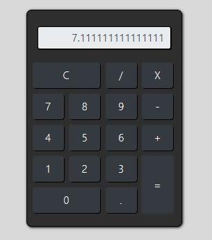

# App Calculator

Welcome! 

This repository contains a App of a simple calculator using some HTML, CSS and Javascript resources such as Functions, Events and DOM..

This project was developed during the [Complete Web Development](https://www.udemy.com/course/web-completo/) course (Section Javascript) held at UDEMY.

* Home Page



# 🧠 About

The goal with this project is learn and practice about this functionalities below:

- [x] Variables
- [x] Concatenation
- [x] Null
- [x] Undefined
- [x] If/else
- [x] Comparison operators (conditional)
- [x] Casting (toString, parseInt, parseFloat)
- [x] Logical operators
- [x] Ternary operator
- [x] Arithmetic operators
- [x] Switch
- [x] Functions
- [x] Scope of variables
- [x] Callback functions
- [x] Events (keyboard, mouse, window, forms) 
- [x] DOM - Selecting page elements
- [x] DOM - Manipulating values ​​of inputs (text)
- [x] DOM - Manipulating element styles
- [x] DOM - Manipulating element classes

## 🖥️ Installation

1. Clone this repo
```bash
git clone https://github.com/robernar2011/AppCalculator.git
```
